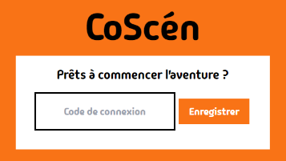
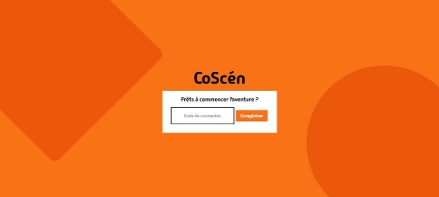
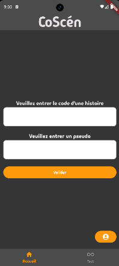

# COSCEN

## Introduction

## Note d'intention
### Concept
Le projet consiste en une histoire interactive où l’objectif est de résoudre l’intrigue
d’une de celle-ci en solo ou avec des amis. Le système est pensé pour jouer des histoires
écrites par n’importe qui (la communauté). Il est donc possible d’écrire une histoire même
pour ses amis !
L’objectif en plus d’une histoire interactive est donc d’apporter une dimension de
navigation en utilisant le téléphone portable comme outil principal. L’utilisateur devra donc
effectuer des choix pour avancer dans l’histoire. Ces choix pourront être influencés par
plusieurs facteurs. Dans certains cas, le choix pourra dépendre de la capacité du joueur à
réagir ou à utiliser son environnement, alors que dans d’autres cas le jeu prendra la main
sur le choix effectué et le joueur se verra destitué de son contrôle sur son téléphone. Le
téléphone servira à faire les choix et un écran principal permettra d’afficher les choix et le
déroulé de l'histoire.

### Public ciblé
L’application s’adresse à des utilisateurs adolescents ou adultes à l'aise avec leur
smartphone. Le public devra jouer en équipe et se faire confiance pour réaliser l'histoire
ensemble et ne pas laisser l’application scinder le groupe par ses prises de décisions ne
laissant pas la main aux utilisateurs. L’application sera disponible sous Android et IOS afin
qu’un maximum de personnes puissent l’utiliser.

### Objectifs
L’objectif de ce projet est donc de faire plonger l’utilisateur dans un monde dans
lequel il pensera avoir le contrôle. Or il découvrira rapidement que les choix peuvent aussi
être influencés par la machine et qu’il ne sera pas entièrement maître de son destin. Cela
consiste aussi à utiliser le numérique comme outil pour passer du temps ensemble. La
création de l’avatar au début de chaque partie permet une meilleure intégration dans
l'histoire, chacun jouera son personnage et chaque partie pourra être différente.

## Cahier des charges
### Ressource média utilisée 
En ce qui concerne l’histoire mise en place nous avons créé le scénario et les
questions et réponses nous même. Cependant des intelligences artificielles génératrices
d’image ont été utilisées pour accompagner le scénario et pour avoir quelque chose de
visuel. Pour générer ces images nous avons utilisé Stable Diffusion. Ainsi dans un cas
général une étape d’une histoire est représentée par une question, des réponses et une
image optionnelle. L’étape d’une histoire peut être modifiée à l’aide des interactions sur le
téléphone. Par exemple il est possible d’afficher un écran noir tant que les joueurs n’ont pas
activé le flash du téléphone.

### Outils et principes de navigation
La navigation au sein d’une histoire est entièrement faite à l’aide du téléphone. Le
site internet ne permet que d’afficher les scènes de l’histoire jouée, en aucun cas il ne
devrait être question de naviguer sur le site pour avancer dans l’histoire. Ainsi nous
définissons pour chaque scène une condition à remplir pour accéder à l’étape suivante.
D’une manière assez simple, ça ne peut concerner que l’attente de la sélection d’une bonne
réponse à une question. Dans d’autres cas, il est aussi possible d’attendre un événement lié
au téléphone des joueurs. Un exemple est l’attente que les joueurs aient pris une photo d’un
objet d’une certaine couleur.
Afin que chaque joueur avance au même rythme que ses coéquipiers il est
nécessaire d’attendre que tous les joueurs remplissent la condition pour avancer. C’est au
rôle du serveur de récupérer chacune des informations afin de vérifier que tous les joueurs
ont rempli la condition pour continuer. Cela met l’accent sur la coopération, pour une énigme
les joueurs doivent travailler ensemble afin que chacun puisse réaliser ce qu’attend le
serveur pour cette scène.

### Formes et degrés d'interactivité
L'interactivité est donc présente sur le téléphone lorsqu’une histoire est jouée. Grâce
aux fonctionnalités du téléphone nous avons pu profiter d’un large choix d’interactions,
toutes différentes les unes des autres. Cela peut commencer par des choses simples
comme le nombre de fois où un joueur a cliqué sur un bouton. D’autres plus complexes à
mettre en place vont demander aux joueurs de s’enregistrer, d’utiliser la caméra de leur
téléphone ou d’activer leur flash. De plus, il est aussi possible pour l’application d’agir sur le joueur. L’exemple le plus simple est de faire vibrer le téléphone. En ce qui concerne la
création d’histoire, seule l’imagination de l’utilisateur est une limite. L’interface est pensée
pour être simple et accessible au plus grand nombre.

### Choix graphiques et interface 
Pour cette partie distinguons la réalisation d’une histoire et l’action de jouer une
partie. L’interface générale du site et de l’application sur le téléphone a pour couleur
l’orange. Chaque scène se veut être la plus simple possible. L’objectif est d’avoir au
maximum une question, une image et des réponses que les joueurs peuvent décider. Ainsi
l’interface évolue au cours de la partie, autant sur le téléphone que sur l’écran de la page
web. Elle est énormément liée à l’interaction mise en place pour la scène. Si les joueurs
doivent prendre en photo un objet, il n’y aura que le logo pour lancer l’appareil photo qui
sera disponible sur l’écran. De même, le fait de rejoindre une histoire à jouer est simple, il
suffit d’obtenir le code et de le rentrer dans l’application sur son téléphone. Chaque joueur
peut avoir son personnage, pour cela nous avons intégré Avataaars au projet, ce qui permet
un large choix de customisation pour rendre son avatar unique, ce dernier apparaîtra dans la
partie.

L’interface de création a été aussi faite de manière à la rendre le plus simple
possible. Elle est composée des étapes de l’histoire et pour chaque étape il est possible
d’éditer du code et de l’html, le code pour la logique, l’html pour la page à renvoyer aux
joueurs.

### Choix techniques
Les différentes scènes d’une histoire ne sont pas validées par l’application du
smartphone ou le site internet. En réalité, une fois qu’une histoire est lancée pour être jouée,
les joueurs n’ont qu’à se laisser guider par les navigations entre les scènes. C’est le serveur
qui s’occupe de tout le déroulement de la partie. D’une part, c'est lui qui va récupérer les
informations sur les réponses données par les joueurs et qui va les traiter. Ainsi la
vérification n’est pas locale et le serveur joue le rôle de maître du jeu. Toujours dans cette
optique, nous lui avons aussi attribué à lui seul la possibilité de changer la scène affichée
pour une histoire. Ainsi, de manière chronologique, le serveur affiche une scène à l’écran et
attend des informations venant des joueurs (dépendantes de l’action à réaliser). Une fois
que les informations sont satisfaisantes, le serveur va pouvoir déduire la prochaine scène à
afficher et ainsi la rendre visible sur l’écran principal.
Afin de rendre le travail commun nous avons utilisé Gitlab pour stocker le code en le divisant
en trois parties : web, app, server.

## Conclusion
Pour conclure, ce projet nous a permis de mettre en place tout un outil afin de
générer des histoires, en plus d’une instance d’une histoire jouable. Cette dernière a pour
vocation d’être un exemple afin de présenter les différentes opportunités que proposent
l’interaction avec un téléphone. Il a donc été nécessaire de travailler diverses fonctionnalités
afin que notre application prenne en charge la caméra, le flash, les vibrations,
l'enregistrement audio. De plus cela nous a mené à la création d’une interface permettant de
construire nos propres histoires et de les implémenter afin de les rendre jouables. Il y a donc
aussi eu un gros travail pour rendre cette interface facile à prendre en main tout en offrant le plus de possibilités possibles pour l’utilisateur afin de rendre ses histoires uniques. Le travail était conséquent, ce projet sera sûrement amené à évoluer afin d’ajouter de nouvelles
fonctionnalités pour rendre l’expérience de l’utilisateur meilleure.

